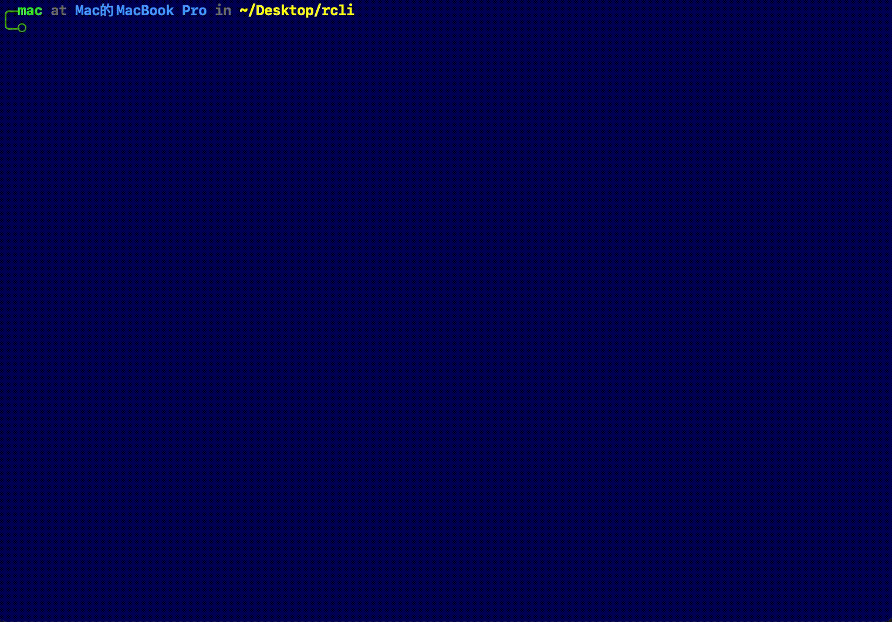
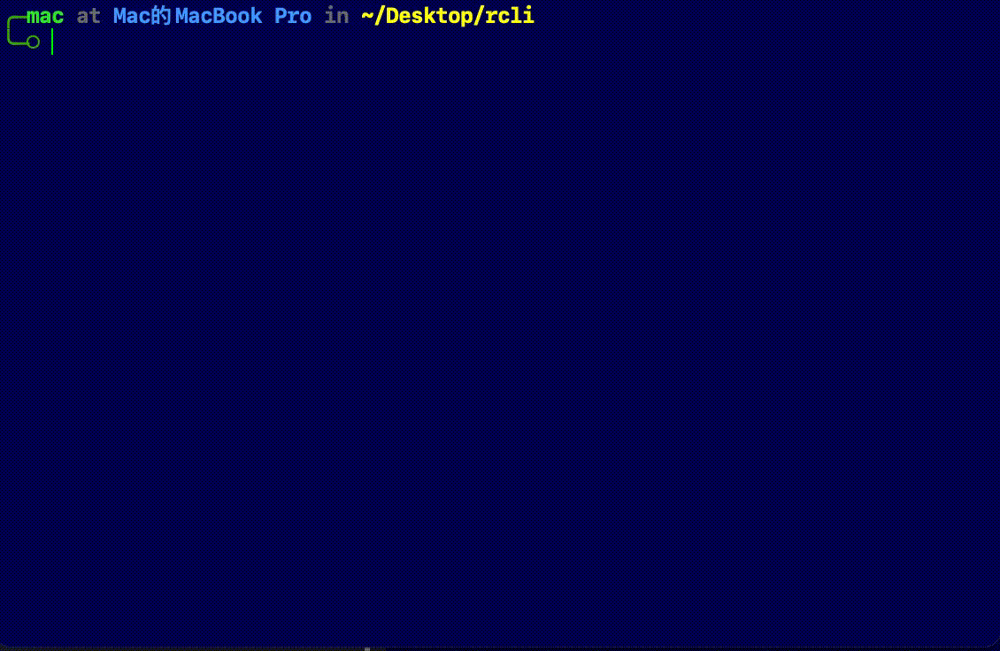

# RCLI

一个用 Rust 构建的命令行工具，提供 CSV 处理、密码生成和 Base64 编码/解码功能。

## 功能特性

### 📊 CSV 处理

- 支持多种输出格式：JSON、YAML、TOML
- 自定义分隔符

### 🔐 密码生成

- 生成高强度随机密码
- 可配置密码长度（默认 16 字符）
- 灵活选择字符类型：
  - 大写字母 (A-Z)
  - 小写字母 (a-z)
  - 数字 (0-9)
  - 特殊符号 (!@#$%^&*_.?)

### 🔤 Base64 编码/解码

- Base64 编码功能
- Base64 解码功能
- 支持多种格式
- 支持从文件或标准输入读取

## 安装

### 前置条件

- Rust 1.70+ 版本

### 构建

```bash
git clone <repository-url>
cd rcli
cargo build --release
```

构建完成后，可执行文件位于 `target/release/rcli`

## 使用方法

### CSV 处理

显示 CSV 文件内容：

```bash
rcli csv -i assets/juventus.csv --show
```

转换 CSV 为 JSON：

```bash
rcli csv -i input.csv -o output.json -f json
```

支持的格式：json、yaml、toml

可用选项：

- `-i, --input <path>` - CSV 文件路径（必需）
- `-o, --output <path>` - 输出文件路径
- `-f, --format <format>` - 输出格式（json/yaml/toml）
- `--delimiter <char>` - 分隔符（默认为逗号）

### 密码生成

生成默认长度（16 字符）的密码：

```bash
rcli genpass
```

生成指定长度的密码：

```bash
rcli genpass -l 32
```

生成不包含特殊符号的密码：

```bash
rcli genpass --no-symbol
```

可用选项：

- `-l, --length <n>` - 密码长度（默认 16）
- `--no-upper` - 禁用大写字母
- `--no-lower` - 禁用小写字母
- `--no-digits` - 禁用数字
- `--no-symbol` - 禁用特殊符号

### Base64 编码/解码

编码字符串：

```bash
echo "Hello, World!" | rcli base64 encode
```

从文件编码：

```bash
rcli base64 encode -i input.txt
```

解码字符串：

```bash
echo ""SGVsbG8sIFdvcmxkIQ=="" | rcli base64 decode
```

支持的格式：

- `standard` - 标准 Base64
- `urlsafe` - URL 安全的 Base64

## 项目结构

```text
rcli/
├── src/
│   ├── main.rs           # 主程序入口
│   ├── lib.rs            # 库文件
│   ├── cli/              # CLI 命令定义
│   │   ├── mod.rs
│   │   ├── base64.rs     # Base64 命令
│   │   ├── csv.rs        # CSV 命令
│   │   └── genpass.rs    # 密码生成命令
│   └── process/          # 业务逻辑处理
│       ├── mod.rs
│       ├── b64.rs        # Base64 处理
│       ├── csv_convert.rs # CSV 转换处理
│       └── gen_pass.rs   # 密码生成处理
├── Cargo.toml
└── README.md
```

## 依赖项

- **clap** - 命令行参数解析
- **serde** - 序列化和反序列化框架
- **csv** - CSV 文件处理
- **base64** - Base64 编码解码
- **rand** - 随机数生成
- **zxcvbn** - 密码强度检测
- **serde_json**, **serde_yaml**, **toml** - 多格式支持
- **anyhow** - 错误处理

## 示例

### CSV 转换示例



### 密码生成示例


### Base64 示例



## 许可证

MIT License - 详见 [LICENSE](LICENSE)

## 作者

gushiii <zrjie001@gmail.com>

## 贡献

欢迎提交 Issues 和 Pull Requests！
